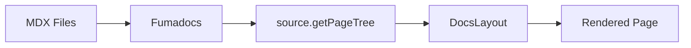

import { Layers, FileJson, Code, FileText } from 'lucide-react';

# Architecture

ObjectDocs is built on a strict **Separation of Concerns** philosophy that separates presentation, configuration, and content into distinct layers.

## Core Principles

### 1. Configuration as Code

Unlike traditional documentation sites where structure is hardcoded in React components, ObjectDocs treats documentation organization as **data**.

<Cards>
  <Card icon={<FileJson />} title="Metadata-Driven">
    Navigation, sidebars, and page ordering are defined in JSON files, not React code.
  </Card>
  <Card icon={<Code />} title="Logic-Free Views">
    React components in `app/` are purely presentational and consume configuration.
  </Card>
</Cards>

### 2. Three-Layer Architecture

```text
┌─────────────────────────────────────────┐
│         Content Layer (MDX)             │  ← Technical Writers
│   /content/docs/**/*.mdx                │
└─────────────────────────────────────────┘
              ↓
┌─────────────────────────────────────────┐
│      Configuration Layer (JSON)         │  ← Platform Architects
│   /content/**/meta.json                 │
│   /packages/site/objectdocs.json        │
└─────────────────────────────────────────┘
              ↓
┌─────────────────────────────────────────┐
│      Presentation Layer (React)         │  ← Frontend Engineers
│   /packages/site/app/**                 │
└─────────────────────────────────────────┘
```

## Directory Structure

### Content Directory

```text
content/
└── docs/
    ├── meta.json              # Root navigation structure
    ├── index.mdx              # Documentation home page
    ├── getting-started/
    │   ├── meta.json          # Getting Started section structure
    │   ├── installation.mdx
    │   ├── architecture.mdx
    │   └── configuration.mdx
    └── components/
        ├── meta.json          # Components section structure
        └── objectui-embed.mdx
```

<Callout type="warn">
**Important**: The sidebar structure is defined entirely by `meta.json` files. Never modify React components to change page ordering.
</Callout>

### Site Package

```text
packages/site/
├── app/                       # Next.js App Router
│   ├── [lang]/
│   │   ├── docs/
│   │   │   ├── [[...slug]]/
│   │   │   │   └── page.tsx  # Dynamic doc page
│   │   │   └── layout.tsx    # Docs layout wrapper
│   │   ├── layout.tsx         # Language layout
│   │   └── page.tsx           # Homepage redirect
│   ├── layout.config.tsx      # Layout configuration
│   └── layout.tsx             # Root layout
├── lib/
│   ├── source.ts              # Content source configuration
│   └── site-config.ts         # Site config loader
├── objectdocs.json            # Global site configuration
└── source.config.ts           # Fumadocs source config
```

## Data Flow

### 1. Content Loading



1. **MDX files** in `content/docs/` are processed by Fumadocs
2. **meta.json** files define the navigation tree structure
3. **source.getPageTree()** generates the sidebar tree
4. **DocsLayout** component renders the final layout

### 2. Configuration Loading

```typescript
// packages/site/lib/site-config.ts
import siteConfig from '../objectdocs.json';

export { siteConfig };
```

The `objectdocs.json` file is imported and used throughout the application to configure:
* Navigation bar links
* Branding (logo, theme colors)
* Sidebar behavior
* Footer content
* TOC settings

## Key Concepts

### Meta.json Format

Each directory can have a `meta.json` file that controls the sidebar structure:

```json
{
  "title": "Section Title",
  "pages": [
    "page-slug",
    "another-page",
    "---Separator---",
    "subsection"
  ]
}
```

* **title**: Display name in the sidebar
* **pages**: Array of page slugs in the desired order
* **Separators**: Use `---Title---` format for visual separators

### Page Frontmatter

Every MDX file should include frontmatter:

```mdx
---
title: Page Title
description: Brief description for SEO and cards
---

# Content starts here
```

## Framework Stack

<Cards>
  <Card title="Next.js 14" icon={<Layers />}>
    App Router with Server Components for optimal performance
  </Card>
  <Card title="Fumadocs" icon={<FileText />}>
    Documentation middleware for MDX processing and tree generation
  </Card>
  <Card title="TypeScript" icon={<Code />}>
    Full type safety across content, config, and components
  </Card>
</Cards>

## Next Steps

Now that you understand the architecture, learn how to configure your site:

<Cards>
  <Card title="Configuration" href="/docs/getting-started/configuration">
    Customize navigation, branding, and features
  </Card>
  <Card title="Components" href="/docs/components/objectui-embed">
    Embed interactive ObjectUI components
  </Card>
</Cards>
